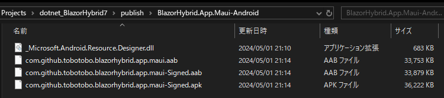

# メモ7

## BlazorHybrid.App.Maui 追加
```
dotnet new maui -o ./src/App/BlazorHybrid.App.Maui -n BlazorHybrid.App.Maui
dotnet sln ./src/BlazorHybrid.sln add ./src/App/BlazorHybrid.App.Maui
dotnet add ./src/App/BlazorHybrid.App.Maui reference ./src/App/BlazorHybrid.App
dotnet add ./src/App/BlazorHybrid.App.Maui reference ./src/View/BlazorHybrid.View
dotnet add ./src/App/BlazorHybrid.App.Maui package Microsoft.AspNetCore.Components.WebView.Maui --version 8.0.21
```

```
dotnet run --project ./src/App/BlazorHybrid.App.Maui 
```

```
dotnet publish ./src/App/BlazorHybrid.App.Maui -f net8.0-windows10.0.19041.0 -c Debug -p:PublishReadyToRun=true -p:WindowsPackageType=None

dotnet publish `
    ./src/App/BlazorHybrid.App.Maui `
    -f net8.0-windows10.0.19041.0 `
    -p:WindowsPackageType=None `
    --self-contained `
    /property:GenerateFullPaths=true `
    -o "./publish/BlazorHybrid.App.Maui"

dotnet publish `
    ./src/App/BlazorHybrid.App.Maui `
    -f net8.0-windows10.0.19041.0 `
    -c Debug `
    -p:WindowsPackageType=None `
    --self-contained `
    /property:GenerateFullPaths=true `
    -o "./publish/BlazorHybrid.App.Maui"

&& ./bin/Debug/net8.0-windows10.0.19041.0/win10-x64/publish/BlazorHybrid.App.Maui.exe
```

## Android

```
dotnet publish `
    ./src/App/BlazorHybrid.App.Maui `
    -f net8.0-android `
    --self-contained `
    /property:GenerateFullPaths=true `
    -o "./publish/BlazorHybrid.App.Maui-Android"
```
```
C:\Program Files\dotnet\packs\Microsoft.Android.Sdk.Windows\34.0.95\tools\Xamarin.Android.Tooling.targets(100,5): error XA5207: API レベル 34 の android.jar が見つかりません。これは、API レベル 34 の Android SDK 
プラットフォームがインストールされていない
ことを意味します。これは、`C:\Program Files (x86)\Android\android-sdk\platforms\android-34\android.jar` であることが想定されます。 [C:\Projects\dotnet_BlazorHybrid7\src\App\BlazorHybrid.App.Maui\BlazorHybrid.App.Maui.csproj::TargetFramewo
rk=net8.0-android]
C:\Program Files\dotnet\packs\Microsoft.Android.Sdk.Windows\34.0.95\tools\Xamarin.Android.Tooling.targets(100,5): error XA5207: 不足している API レベルをインストールするには、`dotnet build -t:InstallAndroidDependencies -f net8.0-andr
oid "-p:AndroidSdkDirectory=C:\Program Files (x86)\Android\android-sdk"` を実行するか、インストールされている API バージョンを対象とするようにプロジェクトを変更します。 [C:\Projects\dotnet_BlazorHybrid7\src\App\BlazorHybrid.App.Maui\BlazorHybrid.App.Maui.cs
proj::TargetFramework=net8.0-android]
C:\Program Files\dotnet\packs\Microsoft.Android.Sdk.Windows\34.0.95\tools\Xamarin.Android.Tooling.targets(100,5): error XA5207: 詳しくは https://aka.ms/xa5207 を参照してください。 [C:\Projects\dotnet_BlazorHybrid7\src\App\Blaz
orHybrid.App.Maui\BlazorHybrid.App.Maui.csproj::TargetFramework=net8.0-android]
```
```
dotnet build `
    ./src/App/BlazorHybrid.App.Maui `
    -t:InstallAndroidDependencies `
    -f net8.0-android `
    "-p:AndroidSdkDirectory=C:\Program Files (x86)\Android\android-sdk"
```
```
> dotnet build `
>>     ./src/App/BlazorHybrid.App.Maui `
>>     -t:InstallAndroidDependencies `
>>     -f net8.0-android `
>>     "-p:AndroidSdkDirectory=C:\Program Files (x86)\Android\android-sdk"
;CMSBuild のバージョン 17.9.8+b34f75857 (.NET)
  復元対象のプロジェクトを決定しています...
  C:\Projects\dotnet_BlazorHybrid7\src\App\BlazorHybrid.App\BlazorHybrid.App.csproj を復元しました (473 ms)。
  C:\Projects\dotnet_BlazorHybrid7\src\App\BlazorHybrid.App.Maui\BlazorHybrid.App.Maui.csproj を復元しました (2.37 sec)。
  9 個中 7 個の復元対象のプロジェクトは最新です。
C:\Program Files\dotnet\packs\Microsoft.Android.Sdk.Windows\34.0.95\tools\Xamarin.Installer.Common.targets(12,3): warning : Android component "tools" is obsolete, please install "cmdline-tools" [C:\Projects\dotne
t_BlazorHybrid7\src\App\BlazorHybrid.App.Maui\BlazorHybrid.App.Maui.csproj::TargetFramework=net8.0-android]
C:\Program Files\dotnet\packs\Microsoft.Android.Sdk.Windows\34.0.95\tools\Xamarin.Installer.Common.targets(12,3): warning : Trying to fallback to "tools"... [C:\Projects\dotnet_BlazorHybrid7\src\App\BlazorHybrid. 
App.Maui\BlazorHybrid.App.Maui.csproj::TargetFramework=net8.0-android]
C:\Program Files\dotnet\packs\Microsoft.Android.Sdk.Windows\34.0.95\tools\Xamarin.Installer.Common.targets(12,3): error : The Android SDK license agreements were not accepted, please set `$(AcceptAndroidSDKLicens
es)` to accept. [C:\Projects\dotnet_BlazorHybrid7\src\App\BlazorHybrid.App.Maui\BlazorHybrid.App.Maui.csproj::TargetFramework=net8.0-android]

ビルドに失敗しました。

C:\Program Files\dotnet\packs\Microsoft.Android.Sdk.Windows\34.0.95\tools\Xamarin.Installer.Common.targets(12,3): warning : Android component "tools" is obsolete, please install "cmdline-tools" [C:\Projects\dotne 
t_BlazorHybrid7\src\App\BlazorHybrid.App.Maui\BlazorHybrid.App.Maui.csproj::TargetFramework=net8.0-android]
C:\Program Files\dotnet\packs\Microsoft.Android.Sdk.Windows\34.0.95\tools\Xamarin.Installer.Common.targets(12,3): warning : Trying to fallback to "tools"... [C:\Projects\dotnet_BlazorHybrid7\src\App\BlazorHybrid. 
App.Maui\BlazorHybrid.App.Maui.csproj::TargetFramework=net8.0-android]
C:\Program Files\dotnet\packs\Microsoft.Android.Sdk.Windows\34.0.95\tools\Xamarin.Installer.Common.targets(12,3): error : The Android SDK license agreements were not accepted, please set `$(AcceptAndroidSDKLicens 
es)` to accept. [C:\Projects\dotnet_BlazorHybrid7\src\App\BlazorHybrid.App.Maui\BlazorHybrid.App.Maui.csproj::TargetFramework=net8.0-android]
    2 個の警告
    1 エラー

経過時間 00:00:03.03
```

[Microsoft Lean - .NET - .NET MAUI - インストール](https://learn.microsoft.com/ja-jp/dotnet/maui/get-started/installation?view=net-maui-8.0&tabs=visual-studio-code)
```
dotnet build -t:InstallAndroidDependencies -f:net8.0-android -p:AndroidSdkDirectory="<AndroidSdkPath>" -p:JavaSdkDirectory="<JavaSdkPath>" -p:AcceptAndroidSDKLicenses=True
```
```
dotnet build `
    ./src/App/BlazorHybrid.App.Maui `
    -t:InstallAndroidDependencies `
    -f net8.0-android `
    -p:AndroidSdkDirectory=%LOCALAPPDATA%/Android/Sdk `
    -p:AcceptAndroidSDKLicenses=True
```
```
dotnet publish `
    ./src/App/BlazorHybrid.App.Maui `
    -f net8.0-android `
    --self-contained `
    /property:GenerateFullPaths=true `
    "-p:AndroidSdkDirectory=C:\Users\user\AppData\Local\Android\Sdk" `
    -o "./publish/BlazorHybrid.App.Maui-Android"
```


## Todo
[Blazor Todo リスト アプリを構築する](https://learn.microsoft.com/ja-jp/aspnet/core/blazor/tutorials/build-a-blazor-app?view=aspnetcore-8.0)

## CSS ファイルの一つ目のスタイルが適用されない
### 原因
charset="utf-8" に対して、ファイルが UTF-8 with BOM で保存されていると発生する。

### 対応
UTF-8 で保存し直す。

### 事象
CSS ファイルの一つ目のスタイルが適用されない。
以下の例の場合、例１は h1 に指定のスタイルが適用されない。例２では h2 に適用されない。

例１
```css
h1 {
  color: red;
}
```

例２
```css
h2, h1 {
  color: red;
}
```

## EF core
```
dotnet add ./src/Model/BlazorHybrid.Model.Impl package Microsoft.EntityFrameworkCore --version 8.0.4
dotnet add ./src/Model/BlazorHybrid.Model.Impl package Microsoft.EntityFrameworkCore.Sqlite --version 8.0.4
dotnet add ./src/Model/BlazorHybrid.Model.Impl package Microsoft.EntityFrameworkCore.Design --version 8.0.4
```

```
dotnet add ./src/Model/BlazorHybrid.Model.Impl.Test package Microsoft.Data.Sqlite --version 8.0.4.0

```

## SQLite インメモリ
* インメモリは接続が閉じられると削除される
* 維持するためには SqliteConnection が必須

```cs
_connection = new SqliteConnection("Filename=:memory:");
_connection.Open();
_contextOptions = new DbContextOptionsBuilder<BloggingContext>()
    .UseSqlite(_connection)
    .Options;
using var context = new BloggingContext(_contextOptions);
```

[Microsoft Lean - 運用データベース システムを使用しないテスト](https://learn.microsoft.com/ja-jp/ef/core/testing/testing-without-the-database)
> インメモリ SQLite を使うには、低レベルの接続が開かれるたびに新しいデータベースが作成され、接続が閉じられると削除されることを理解することが重要です。 通常の使用方法では、不必要に長い時間接続を維持しないように、クエリを実行するたびに、EF Core の DbContext によって必要に応じてデータベース接続を開く処理と閉じる処理が行われます。 ただし、インメモリ SQLite の場合、この方法では毎回データベースをリセットすることになります。そこで、回避策として、EF Core に渡す前に接続を開き、テストが完了したときにのみ閉じるように調整します。

## 保存先のパス
[.NET MAUI (データストア)](https://qiita.com/kashin777/items/03bcfa6c0f17178911e2)

maui
```
// アプリケーションデータはこっち
string mainDir = FileSystem.Current.AppDataDirectory;
// キャッシュデータはこっち
string cacheDir = FileSystem.Current.CacheDirectory;

string path = Path.Combine(FileSystem.Current.AppDataDirectory, "count.db3");
```